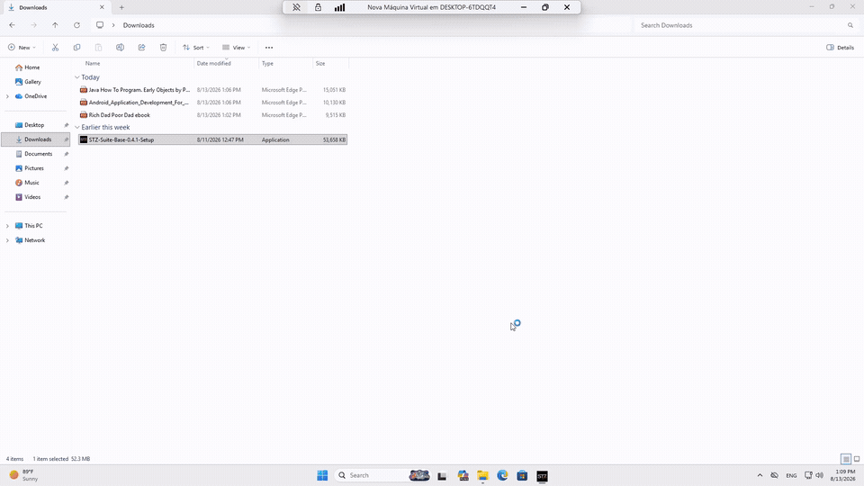
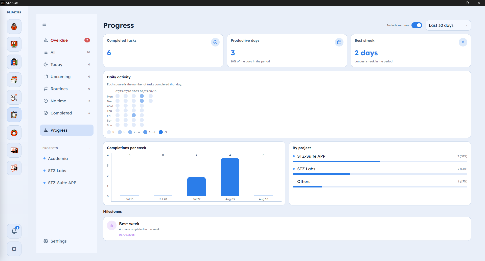

# STZ Suite

<p align="center">
  
</p>

**A local-first plugin platform for Windows. Install only the tools you want — no account, no subscription, no telemetry.**

<p align="center">
  <a href="https://github.com/starzynhobr/stz-suite-releases/releases/download/stz-suite-base-v0.4.1/STZ-Suite-Base-0.4.1-Setup.exe"><strong>Download STZ Suite 0.4.1</strong></a>
  · Windows 10/11, x64 · 52.4 MiB
</p>

> [!IMPORTANT]
> The installer is not code-signed yet, so Windows SmartScreen may show a warning. Every Base release includes a SHA-256 checksum so you can verify the downloaded file.

## What is STZ Suite?

STZ Suite is a lightweight desktop shell for independent utilities. The Base starts empty: open **Settings → Plugins**, choose the tools you need, and the official catalog handles installation and updates.

- **Local-first:** app data and preferences stay on your computer.
- **Modular:** plugins are installed and updated independently.
- **Private by default:** no account and no telemetry.
- **Free to use:** no subscription or feature paywall.

Some features intentionally access the internet — for example, downloading media, book metadata, translation models, catalog updates, or optional sync. The Suite does not claim that every plugin is permanently offline.

## How it works

1. Install the small Base application.
2. Open **Settings → Plugins** and install only the tools you want.
3. Receive verified plugin updates through the official catalog.

<p align="center">
  
</p>

## Official plugins

| Plugin        | What it does                                                                      |
| ------------- | --------------------------------------------------------------------------------- |
| **Fetchora**  | Downloads web media and converts local audio/video files with queues and presets. |
| **Lumio**     | Organizes and reads PDF, EPUB, CBZ, and CBR files with saved progress.            |
| **Reperto**   | Tracks books and other media you plan to consume, are consuming, or completed.    |
| **Tempoza**   | Runs focus/break cycles with presets, background audio, and alarms.               |
| **Orbhia**    | Organizes financial goals, purchases, installments, and subscriptions.            |
| **Ordelya**   | Manages tasks, projects, steps, routines, progress, and reminders.                |
| **Glotiva**   | Translates text locally with language-pair models installed on demand.            |
| **Cursorium** | Records and replays mouse movements and clicks with shortcuts and repetition.     |
| **Tunerium**  | Provides network diagnostics and controlled Windows maintenance adjustments.      |

<table>
  <tr>
    <td width="50%"><br><strong>Lumio</strong> — local reading library</td>
    <td width="50%"><br><strong>Tempoza</strong> — focus timer</td>
  </tr>
  <tr>
    <td width="50%"><br><strong>Glotiva</strong> — local translation</td>
    <td width="50%"><br><strong>Ordelya</strong> — tasks and routines</td>
  </tr>
</table>

## Install

1. [Download the latest Base installer](https://github.com/starzynhobr/stz-suite-releases/releases/latest).
2. Run the installer. The default per-user location is `%LocalAppData%\Programs\STZ Suite`.
3. Open **Settings → Plugins** to build your collection.

### Verify the installer

The SHA-256 for `STZ-Suite-Base-0.4.1-Setup.exe` is:

```text
cee317a554b393df93740e66952fa9dea00b58d49e3a917f3360b216298f5105
```

Compare it with the attached [`STZ-Suite-Base-0.4.1-Setup.sha256.txt`](https://github.com/starzynhobr/stz-suite-releases/releases/download/stz-suite-base-v0.4.1/STZ-Suite-Base-0.4.1-Setup.sha256.txt) file. PowerShell can calculate the local hash:

```powershell
Get-FileHash -Algorithm SHA256 .\STZ-Suite-Base-0.4.1-Setup.exe
```

Review the public [VirusTotal report](https://www.virustotal.com/gui/file/cee317a554b393df93740e66952fa9dea00b58d49e3a917f3360b216298f5105/detection) for this exact installer.

## Feedback and support

- [Ask a question or share an idea](https://github.com/starzynhobr/stz-suite-releases/discussions)
- [Report a bug](https://github.com/starzynhobr/stz-suite-releases/issues/new/choose)
- [Explore STZ Suite on the STZ Labs website](https://stzlabs.com/projects/stz-suite)

This repository contains public release artifacts and the official plugin catalog. It does **not** contain the application source code. Technical publishing notes are kept in [`PUBLISHING.md`](./PUBLISHING.md).
